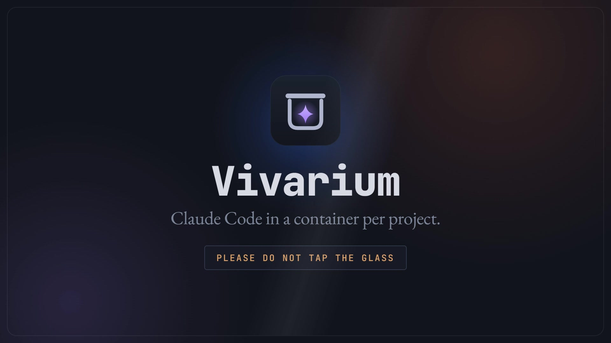

# Vivarium

A minimal Windows desktop session manager that runs **Claude Code** agents in isolated
Docker containers with **selective folder mounts**, and groups terminal sessions by project.

[](docs/brag.mp4)

<sub>24-second tour, with sound. Music: "Happy Beats / Business Moves" by
[ende.app](https://ende.app/en), CC BY 4.0.</sub>

Built to replace juggling Windows Terminal tabs when working on monorepos where the AI agent
should only see *some* folders (e.g. `frontend` + `frontend-dep`, never `backend`/`.git`).
Isolation is physical: only the folders you select are bind-mounted into the container.

## What it does

- **One container per project**, created lazily on first session start (`vivarium-<project>`).
- Three session types, all rendered in a single terminal view (no tabs, no panes):
  - **Agent** — `docker exec … claude --dangerously-skip-permissions` in the container.
  - **Terminal · container** — `bash` inside the container (`/workspace`).
  - **Terminal · host** — PowerShell (`pwsh`, falling back to `powershell`) in the project folder.
- Selected folders mount at `/workspace/<leaf>`; `node_modules` / `.angular` / `target` are
  shadowed by container-local volumes so installs never touch the Windows checkout.
- Backend ports (`9980`, `8080`) on the Windows host are reachable at `localhost:<port>` inside
  the container (socat relay + WSL2 gateway detection).
- **Published dev-server port** is forwarded **only for `full`-image projects**.
- Paste an image from the Windows clipboard into an agent with **Ctrl+V** — it is written into a
  container-mounted temp dir and its path typed into the prompt.

### Session persistence

Sessions have **no multiplexer** (no tmux): an agent runs as a plain `docker exec`. It survives
switching between sessions (its pty is kept alive in the background) but **stops when you quit
the app** and cannot be reattached across app restarts. Quitting the app never stops the
container — only the project's explicit stop control does.

## Prerequisites

- **Docker Desktop** or **Rancher Desktop** with the `docker` CLI on your `PATH`.
- **Node 20+** (for development / building the app).
- Windows 10/11.

## Development

```powershell
npm install        # also rebuilds node-pty against Electron (postinstall)
npm run dev        # electron-vite dev server + Electron
```

The first time you start a project's container the image is built (~1–2 min for slim, ~5–10 min
for full); build output streams into that session's terminal.

## Build a Windows installer

```powershell
npm run build:win  # electron-vite build + electron-builder (NSIS installer in dist/)
```

## Configuration

App state lives in a single file: `%APPDATA%/vivarium/config.json`
(projects, mounts, image variant, published port, sessions). Runtime state (whether a container
is running) is queried live from Docker and not stored.

## Notes

- Editing a project's mounts is blocked while its container is running — stop it first.
- Saving settings on a running container recreates it so new mounts/image/port take effect.
- The container logic was ported from a `claude-box.ps1` reference script, now kept only in git
  history — the `(ref …)` comments in `src/main/docker.ts` cite its line numbers.
